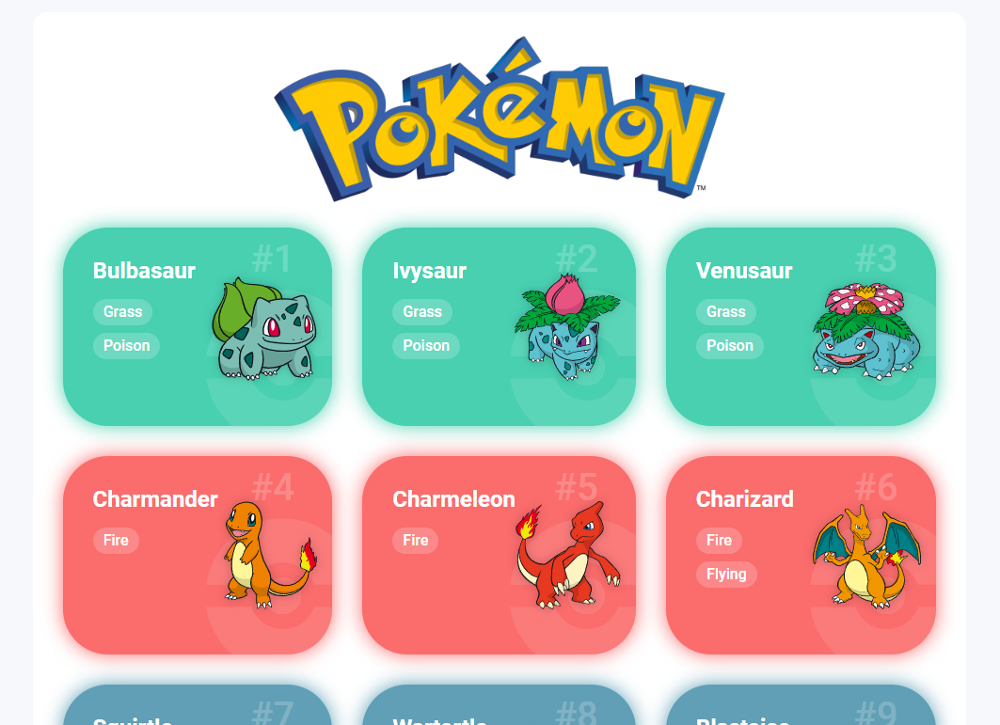

## Trilha JS Developer - Pokedex
Pokedex criada utilizando a [PokeAPI](https://pokeapi.co/api/v2/), seguindo o desafio JS do bootcamp FullStack Java+Angular da [DIO](web.dio.me) e baseado no projeto [Dribbble](https://dribbble.com/shots/6545819-Pokedex-App) do Saepaul Nahwan.

# Desafio de Projeto
- Fazer melhorias no projeto base

